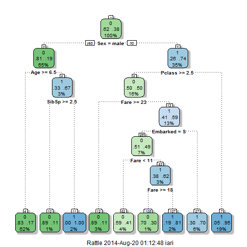

Coursera "Data Science" - Titanic Kaggle Competition
========================================================
The task is to predict whether a given passenger survived the sinking of the Titanic based on various attributes including sex, age, location of the passenger's cabin on the ship, family members, the fare they paid, and other information.

The solution is implemented in R, as follows:
1. Training and Test Data are loaded into R
2. Features to be used to in prediction algorithm are selected
3. Data Cleansing and Preparation is performed.
4. The training data set is further split in training and validation set.
5. The predictive algorithm is trained using the training data set.
6. Prediction error is measured on the validation set.
7. The Prediction Algorithm is finally applied on test set and compared towards the expected outcome.

I followed the instructions of mentioned in:
http://trevorstephens.com/post/72916401642/titanic-getting-started-with-r

## Data 

The training data for this project are available here: 
https://www.kaggle.com/c/titanic-gettingStarted/download/train.csv

The test data are available here: 
https://www.kaggle.com/c/titanic-gettingStarted/download/test.csv


## Data Ingestion

First we load the training and test data sets into R (training and testing data frames).


```r
Sys.getlocale(category = "LC_ALL")
```

```
## [1] "LC_COLLATE=Greek_Greece.1253;LC_CTYPE=Greek_Greece.1253;LC_MONETARY=Greek_Greece.1253;LC_NUMERIC=C;LC_TIME=Greek_Greece.1253"
```

```r
Sys.setlocale("LC_TIME", "English_US")
```

```
## [1] "English_United States.1252"
```

```r

training <- read.csv("./data/train.csv")
training$Survived <- as.factor(training$Survived)
```


```r
testing <- read.csv("./data/test.csv")
```


# Feature Selection
In order to select the numeric features to be used as predictors, we calculate the correlation between features and we locate those which have maximum impact on others (absolute value of correlation > 0.5)
The list of most important numeric features is the following:
- Fare
- Pclass


```r
M <- abs(cor(training[sapply(training[], is.numeric)]))
diag(M) <- 0
which(M > 0.5, arr.ind = T)
```

```
##        row col
## Fare     6   2
## Pclass   2   6
```


Using only the numeric features did not work well (the prediction accuracy was unacceptably low), therefore I revisited the features and selected also some of the non-numeric which seem very important.

We therefore construct and plot a decision tree to check the impact of each feature.


```r
library(rpart)
library(rattle)
```

```
## Rattle: A free graphical interface for data mining with R.
## Version 3.0.2 r169 Copyright (c) 2006-2013 Togaware Pty Ltd.
## Type 'rattle()' to shake, rattle, and roll your data.
```

```r
library(rpart.plot)
library(RColorBrewer)
fit <- rpart(Survived ~ Fare + Pclass + Sex + Age + SibSp + Parch + Embarked, 
    data = training, method = "class")
fit
```

```
## n= 891 
## 
## node), split, n, loss, yval, (yprob)
##       * denotes terminal node
## 
##   1) root 891 342 0 (0.61616 0.38384)  
##     2) Sex=male 577 109 0 (0.81109 0.18891)  
##       4) Age>=6.5 553  93 0 (0.83183 0.16817) *
##       5) Age< 6.5 24   8 1 (0.33333 0.66667)  
##        10) SibSp>=2.5 9   1 0 (0.88889 0.11111) *
##        11) SibSp< 2.5 15   0 1 (0.00000 1.00000) *
##     3) Sex=female 314  81 1 (0.25796 0.74204)  
##       6) Pclass>=2.5 144  72 0 (0.50000 0.50000)  
##        12) Fare>=23.35 27   3 0 (0.88889 0.11111) *
##        13) Fare< 23.35 117  48 1 (0.41026 0.58974)  
##          26) Embarked=S 63  31 0 (0.50794 0.49206)  
##            52) Fare< 10.82 37  15 0 (0.59459 0.40541) *
##            53) Fare>=10.82 26  10 1 (0.38462 0.61538)  
##             106) Fare>=17.6 10   3 0 (0.70000 0.30000) *
##             107) Fare< 17.6 16   3 1 (0.18750 0.81250) *
##          27) Embarked=C,Q 54  16 1 (0.29630 0.70370) *
##       7) Pclass< 2.5 170   9 1 (0.05294 0.94706) *
```

```r
fancyRpartPlot(fit)
```

 


## Data Cleansing and Preparation

However, random forest excludes records with missing feature values (e.g. Age).

Therefore, we print the summary of training data set values in order to locate features with missing values and we estimate them as follows:


```r
summary(training)
```

```
##   PassengerId  Survived     Pclass    
##  Min.   :  1   0:549    Min.   :1.00  
##  1st Qu.:224   1:342    1st Qu.:2.00  
##  Median :446            Median :3.00  
##  Mean   :446            Mean   :2.31  
##  3rd Qu.:668            3rd Qu.:3.00  
##  Max.   :891            Max.   :3.00  
##                                       
##                                     Name         Sex           Age       
##  Abbing, Mr. Anthony                  :  1   female:314   Min.   : 0.42  
##  Abbott, Mr. Rossmore Edward          :  1   male  :577   1st Qu.:20.12  
##  Abbott, Mrs. Stanton (Rosa Hunt)     :  1                Median :28.00  
##  Abelson, Mr. Samuel                  :  1                Mean   :29.70  
##  Abelson, Mrs. Samuel (Hannah Wizosky):  1                3rd Qu.:38.00  
##  Adahl, Mr. Mauritz Nils Martin       :  1                Max.   :80.00  
##  (Other)                              :885                NA's   :177    
##      SibSp           Parch            Ticket         Fare      
##  Min.   :0.000   Min.   :0.000   1601    :  7   Min.   :  0.0  
##  1st Qu.:0.000   1st Qu.:0.000   347082  :  7   1st Qu.:  7.9  
##  Median :0.000   Median :0.000   CA. 2343:  7   Median : 14.5  
##  Mean   :0.523   Mean   :0.382   3101295 :  6   Mean   : 32.2  
##  3rd Qu.:1.000   3rd Qu.:0.000   347088  :  6   3rd Qu.: 31.0  
##  Max.   :8.000   Max.   :6.000   CA 2144 :  6   Max.   :512.3  
##                                  (Other) :852                  
##          Cabin     Embarked
##             :687    :  2   
##  B96 B98    :  4   C:168   
##  C23 C25 C27:  4   Q: 77   
##  G6         :  4   S:644   
##  C22 C26    :  3           
##  D          :  3           
##  (Other)    :186
```

```r

which(training$Embarked == "")
```

```
## [1]  62 830
```

```r
training$Embarked[c(62, 830)] <- "S"
training$Embarked <- as.factor(training$Embarked)

Agefit <- rpart(Age ~ Pclass + Sex + SibSp + Parch + Fare + Embarked, data = training[!is.na(training$Age), 
    ], method = "anova")
training$Age[is.na(training$Age)] <- predict(Agefit, training[is.na(training$Age), 
    ])
summary(training$Age)
```

```
##    Min. 1st Qu.  Median    Mean 3rd Qu.    Max. 
##    0.42   21.50   27.80   29.60   37.00   80.00
```


## Preparation for Cross-Validation

In order to measure our model we partition our training set into two parts (75%, 25%): train1, test1 data frames.


```r
library(caret)
```

```
## Loading required package: lattice
## Loading required package: ggplot2
```

```r
library(randomForest)
```

```
## randomForest 4.6-7
## Type rfNews() to see new features/changes/bug fixes.
```

```r
inTrain <- createDataPartition(training$Survived, p = 0.75, list = FALSE)
train1 <- training[inTrain, ]
test1 <- training[-inTrain, ]
```


## Prediction Models

We will be using Random Forest based on the first part of our training set (train1). 
We are now ready to train our model using the Random Forest algorithm:

```r
# rf1 <- randomForest(Survived ~ Pclass + Sex + Age + SibSp + Parch + Fare +
# Embarked, data=train1, importance=TRUE, ntree=2000)
rf1 <- train(Survived ~ Pclass + Sex + Age + SibSp + Parch + Fare + Embarked, 
    train1, method = "rf")
```


## Error Estimation

We will estimate errors by comparing predictions towards the real classe values of the second part of training set (test1).
Error probability and number of correct predictions are displayed below:


```r
pred1 <- predict(rf1, test1[, -2])
A <- table(pred1, test1$Survived)
A
```

```
##      
## pred1   0   1
##     0 127  23
##     1  10  62
```

```r
error1 <- (sum(A) - sum(diag(A)))/sum(A)
predRight1 <- pred1 == test1$Survived

error1
```

```
## [1] 0.1486
```

```r
sum(predRight1)
```

```
## [1] 189
```


## Final Prediction Outcome

The prediction outcome of the final model on the original test set is:


```r
predict(rf1, testing)
```

```
##   [1] 0 0 0 0 0 0 1 0 1 0 0 1 0 1 1 0 0 0 1 0 0 0 1 0 1 0 0 0 0 0 0 0 0 0 0
##  [36] 0 1 1 0 0 1 0 0 0 1 1 0 0 0 1 0 0 0 1 1 1 0 0 1 1 0 0 0 1 1 1 0 1 1 0
##  [71] 0 1 0 1 0 1 0 0 1 0 0 0 1 0 0 1 0 0 0 0 1 1 1 0 1 1 1 1 1 0 1 0 0 0 0
## [106] 0 0 0 0 0 0 0 0 1 0 0 0 0 0 0 1 1 0 0 1 0 0 1 1 1 0 0 0 0 0 0 0 0 1 1
## [141] 0 1 1 0 1 1 1 0 1 0 0 0 0 0 1 0 1 0 0 1 1 1 0 1 0 1 0 0 0 1 0 0 0 1 1
## [176] 0 1 0 1 0 0 0 0 1 0 1 0 1 0 1 1 1 1 0 0 1 0 1 1 0 0 0 0 0 1 0 0 0 1 1
## [211] 0 0 0 1 1 0 0 0 0 0 1 1 1 0 0 1 0 0 0 1 0 0 0 0 0 1 1 1 0 0 0 0 1 1 1
## [246] 0 0 0 0 0 0 0 0 1 0 1 0 0 0 1 0 1 0 0 0 0 0 0 0 1 1 0 1 0 1 1 0 0 0 1
## [281] 0 1 0 0 1 1 0 1 0 1 0 0 1 0 0 1 1 0 0 0 0 0 0 1 0 0 0 0 0 1 0 0 0 1 0
## [316] 1 0 0 1 0 1 0 0 0 0 0 1 1 0 1 0
## Levels: 0 1
```

